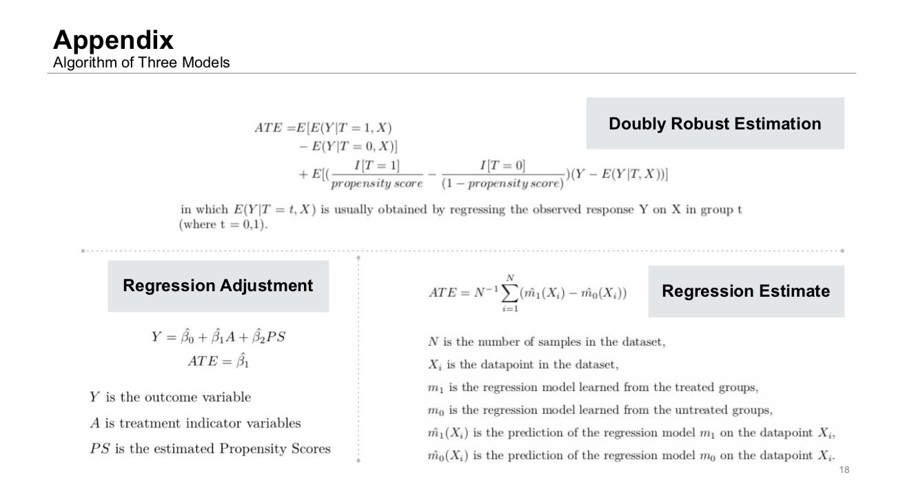
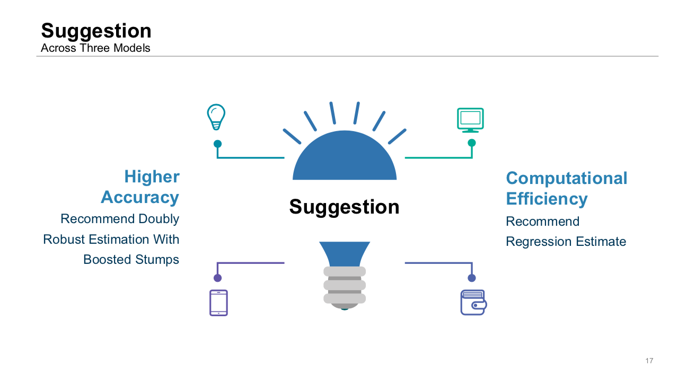

# Project 4: Causal Inference

### [Project Description](doc/project4_desc.md)

Term: Fall 2020

+ Team # 5
+ Projec title: Causal Analysis With Comparison Of Three Models
+ Team members
	+ Xinyi Zhang
	+ Yue Liang
	+ Xuejie Ma
	+ Yiqi Lei
	+ Jiaqi Yuan
+ Project summary: 
	+ Our Goal: Compare the performance(runtime & accuracy) the following 3 algorithms on two datasets (high dimensional dataset and low dimensional dataset):
		1. Doubly Robust Estimation + Boosted Stumps
		2. Regression Adjustment + Boosted Stumps
		3. Regression Estimate
	+ Methodology and Algorithms:
	
	+ Datasets: Implement the three models on both Low Dimension Dataset and High Dimension Dataset
	+ Causal Effect: Utilize the Propensity Scores and the variables to calculate the Average Treatment Effect (ATE)
	+ Results and Conclusions:
	
	All of the models are well-performed after tuning. From the table above, we can see that the Doubly Robust Estimation + Boosted Stumps model has the smallest difference with the true ATE on both of the datasets. Results of Regression Estimate and Regression adjustment are close on the low dimension datasets while the former model outperformed on high dimension datasets. 
	
	Comparing the training time on each of the methods and the datasets, the regression estimate has the shortest training time on both of the datasets. Regression adjustment + boosted stumps have a shorter training time than doubly robust estimation on the high dimension dataset, but longer on the low dimension dataset. We conclude that the regression estimate is more computationally efficient than the Doubly Robust Estimation + Boosted Stumps model.
	
	For model flexibility, we would recommend Doubly Robust Estimation + Boosted Stumps, as it can be customized with grid search and achieve higher accuracy for high and low dimension data. For computational efficiency, the Regression Estimate would give an informative idea of the ATE between the experiment and the control group in a productive manner.

	
**Contribution statement**: All team members contributed equally in all stages of this project. All team members approve our work presented in this GitHub repository including this contributions statement. 
- Xinyi Zhang: Worked on Regression Adjustment and Boosted Stumps with Jiaqi. Studied the papers, implemented the method in R, and compared the model performance between the two datasets. Summed up and finalized the test report. 
- Yue Liang: Conducted research on Regression Estimate and implemented it on two different datasets; compare the results of Regression Estimate to the other two models; come up with a conclusion of the model; prepare slides for the presentation and present it in class; 
- Yiqi Lei: studied Doubly Robust Estimation and boosted stumps, did grid search on parameters, implemented the algorithm for datasets, and estimated the ATEs with Xujie Ma.
- Jiaqi Yuan: Worked on Regression Adjustment and Boosted stumps with Xinyi. We read the original paper,implemented algorithm, conducted grid search and compared model performance on different datasets
- Xujie Ma: implemented a version of Doubly Robust Estimation, verified different calculation methods to ensure they both get correct answers and compiled a part of the main book.


Following [suggestions](http://nicercode.github.io/blog/2013-04-05-projects/) by [RICH FITZJOHN](http://nicercode.github.io/about/#Team) (@richfitz). This folder is orgarnized as follows.

```
proj/
├── lib/
├── data/
├── doc/
├── figs/
└── output/
```

Please see each subfolder for a README file.
